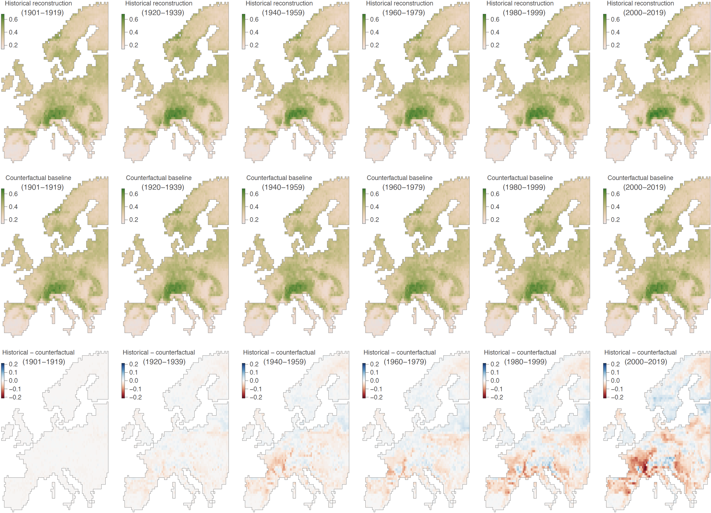

Impact of climate change on European bumblebees
===============

This repo gathers the input files and scripts related to our study entitled "**Declines in European bumblebee habitat suitability attributable to climate change**" (De Tandt *et al*., *submitted*). R scripts used to conduct the different ecological niche modelling and projections described in that study are all available in `Script_ENM_study.r`.

Climate change is increasingly implicated in the decline of insect pollinator populations, which provide critical ecosystem services. Isolating its contribution from other co-occurring environmental stresses remains challenging yet crucial for informing conservation strategies and mitigating biodiversity losses. Here, we isolate the role of climate change by comparing predictions of areas ecologically suitable for European bumblebee species from 1901 to 2019 under factual simulations to predictions under counterfactual climatic conditions where long-term climatic trends were removed. Climate change reduced community-level ecological suitability across Europe by 5% on average and up to 19% locally, with pronounced declines in southern and central regions. In contrast, in the Alpine and Boreal regions, gains at higher altitudes partially offset losses at lower latitudes and altitudes, resulting in minimal net changes. Our results demonstrate that climate change is reshaping the ecologically suitable areas for these key pollinators and represents a pervasive pressure on European wildlife.

**Figure 1. Isolated impact of climate change on the ecological suitability of Europe for 47 bumblebee species.** We report, for each period, the difference between bumblebee ecological suitability estimates based on (i) the reconstructions of the historical climate (first row) and (ii) a counterfactual baseline (second row). The third row of maps reports the difference, for each time period, between the two, i.e., between the estimates based on the reconstructions of the historical climate and the counterfactual baseline. We focus on the ecological suitability index (ESI), defined as the local mean ecological suitability averaged over species (ranging from 0 to 1). The computation of the ESI metric was based on species-specific ecological suitability maps, which were obtained by averaging over the estimates of ten independent BRT models trained on present-day data retrieved from the ISIMIP3a reanalysis dataset GSWP3-W5E5. See Figures S5-S7 for the corresponding results based on the three other ISIMIP3a reanalysis datasets — 20CRv3, 20CRv3-ERA5, and 20CRv3-W5E5 — considered in the present study.

### R packages used in this study, software requirements, and computation times

All the remaining data analyses and visualisations were done in [R](https://www.r-project.org/) v4.5.2 and centralised within a single R script (`Script_ENM_study.r`). In addition, the following R packages – all available on [CRAN](https://cran.r-project.org/) – were used for the data analyses and visualisation: "ade4", "ape", "beeswarm", "blockCV", "colorspace", "diagram", "dismo", "gbm", "geosphere", "ggplot2", "HDInterval", "lubridate", "ncdf4", "ncf", "picante", "phytools", "RColorBrewer", "raster", "rgdal", "rgeos", "seqinr", "sf", "sp", and "vioplot". All the analyses were ran locally on a desktop computer (Apple MacStudio) with MacOS 26.2 and took in total less than two days. Here are the different analytical steps gathered within the R script `Script_ENM_study.r`:

* (1) Preparation of the different land cover and climatic environmental rasters;
* (2) Loading and ploting all the occurrence records for each Bombus species in Europe;
* (3) Boosted regression tree analyses with a spatial cross-validation procedure;
* (4) Computation of the prevalence-pseudoabsence-calibrated Sørensen index;
* (5) Computation and analysis of the relative influence of each environmental factor;
* (6) BRT projections based on historical and counterfactual climate simulations;
* (7) Computation and mapping of the ESI and SRI metrics for the different time periods;
* (8) Computation and mapping of the evolution of the Boyce index (BI) through time.
